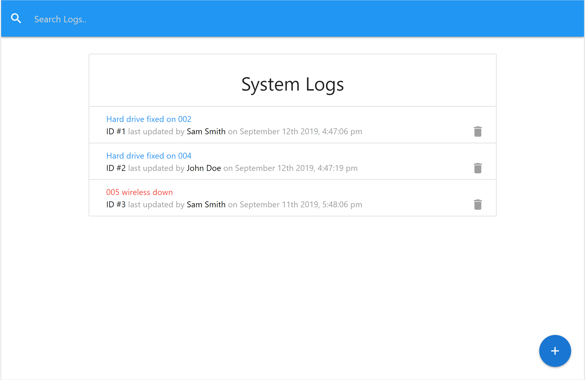

# Tech Logger App

This application for technicians to keep track of open and closed issues with date, time, and last updates.

## Tech/Framework

Stack:

- React.js
- Redux
- JSON server
- Materialize

### Installations

1. Install dependencies with `npm install`
2. Run app on localhost:3000 with `npm run dev`

# Features

### Feature Overview

- System logs table wit update feature
- Add new technician
- Enter system log message with/without required attention

### Feature Description

- **System logs table:**
  
