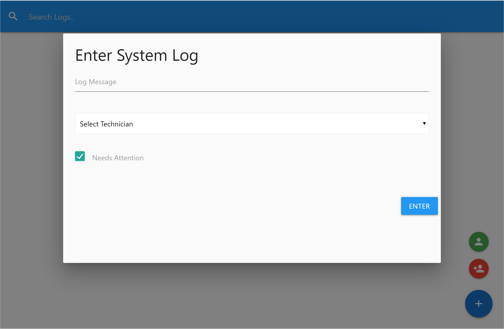

# Tech Logger App

This application for technicians to keep track of open and closed issues with date, time, and last updates.

## Tech/Framework

Stack:

- React.js
- Redux
- JSON server
- Materialize

### Installations

1. Install dependencies with `npm install`
2. Run app on localhost:3000 with `npm run dev`

# Features

### Feature Overview

- System logs table wit update feature
- Add new technician
- Enter system log message with/without required attention

### Feature Description

- **System logs table:** Users can review the latest issues with technicians assign and priority of the task. In the search bar, the user can filter the log by technician name or task.

  

- **Add new technician:** Assign new technician and add in technician list.

  

  

- **Enter system log:** Users can type the message, add a technician to review with/without prioritizing of issue.

  

- **Delete feature:** Users can also remove the message or technicians from list.
